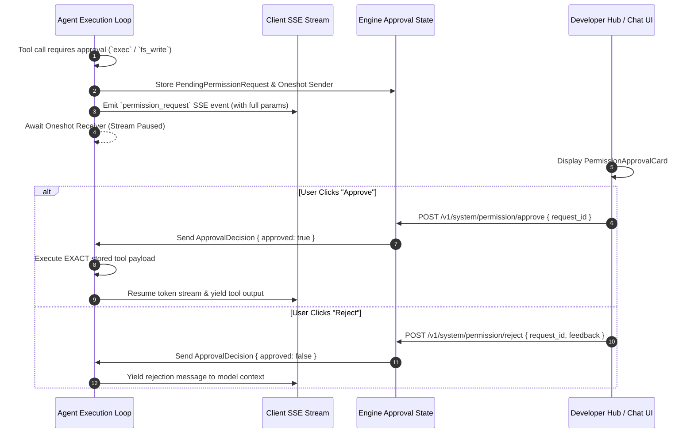

# Security & Human-in-the-Loop (HITL) Permission Gate API

> **Base Route:** `/v1/system/permission`  
> **Security Protocol:** Capability-Based Security & Real-Time Approval Channels  
> **Component:** `cluaiz_api::handlers::permission`, `engines::neural_foundry::security::permission_schema`

---

## 1. System Overview

The Cluaiz Permission system governs two critical security domains:
1. **System Governance Policy (`permission.json`):** Sets engine security modes (`strict`, `sandboxed`, `full_access`), active workspace boundaries, API authentication requirements, and WASM firewalls.
2. **Real-Time Human-in-the-Loop (HITL) Approval Gate:** Pauses streaming agent execution via in-memory `tokio::sync::oneshot` channels whenever an agent invokes a tool declaring sensitive capabilities (`exec`, `fs_write`, `network`) or accesses filesystem resources outside safe boundaries.



---

## 2. Policy Configuration Endpoints

### 2.1 Get Permission Policy (`GET /v1/system/permission`)

Retrieves the active engine permission schema along with dynamically probed model availability lists and local network IP addresses.

* **Path:** `/v1/system/permission`
* **Method:** `GET`

#### Response (`200 OK`)
```json
{
  "security_mode": "sandboxed",
  "workspace_root": "C:\\Users\\Developer\\Workspace",
  "allowed_paths": [],
  "api_auth": {
    "required": true,
    "tokens": ["sk-cluaiz-8180e2bfd7a049efa670570909bd6812"]
  },
  "wasm_firewall": "strict",
  "vectorize_user_input": true,
  "vectorize_ai_response": true,
  "stream_telemetry": false,
  "model_header_info": true,
  "active_slots": {
    "text": { "model_id": "llama_3.2_instruct-3b", "supported_tasks": ["chat"] }
  },
  "available_models": ["llama_3.2_instruct-3b", "whisper_base"],
  "available_chat_models": ["llama_3.2_instruct-3b"],
  "available_vector_models": ["bge-small-en-v1.5"]
}
```

> **Client Security Note:** The API returns authorized tokens to the local developer client UI, which renders them masked by default and enables the user to securely reveal or copy them on demand via client-side controls.

---

### 2.2 Update Permission Policy (`POST /v1/system/permission`)

Updates `permission.json` dynamically and triggers runtime synchronization across active model slots.

* **Path:** `/v1/system/permission`
* **Method:** `POST`
* **Content-Type:** `application/json`
* **Authorization:** `Bearer <token>` (required when `api_auth.required` is `true`)

#### Request Payload
```json
{
  "security_mode": "sandboxed",
  "workspace_root": "C:\\Users\\Developer\\Workspace",
  "api_auth": {
    "required": true,
    "tokens": ["sk-••••a3f9"]
  },
  "wasm_firewall": "strict",
  "vectorize_user_input": true,
  "stream_telemetry": false
}
```

| Field | Type | Options | Description |
|---|---|---|---|
| `security_mode` | `string` | `"strict"`, `"sandboxed"`, `"full_access"` | Governs filesystem containment and tool execution gates. |
| `workspace_root` | `string` | Absolute path | Directory path used as the base anchor for all relative filesystem calls. |
| `api_auth.required` | `boolean` | `true`, `false` | When `true`, all external API calls require a Bearer token. |
| `api_auth.tokens` | `array[string]` | List of API keys | Authorized API keys (masked tokens preserved during patch). |
| `wasm_firewall` | `string` | `"strict"`, `"permissive"` | OS-level syscall isolation for WASM plugins. |
| `vectorize_user_input` | `boolean` | `true`, `false` | Real-time RAG embedding pipeline toggle. |

#### Response (`200 OK`)
```json
{
  "status": "success",
  "message": "permission.json successfully updated."
}
```

---

### 2.3 Generate API Access Token (`POST /v1/system/auth/token/generate`)

Generates a new secure random API access token (`sk-cluaiz-...`), appends it to `permission.json`, and returns the unmasked token in a single-use response. Up to 5 tokens can be active simultaneously.

* **Path:** `/v1/system/auth/token/generate`
* **Method:** `POST`
* **Authorization:** `Bearer <token>` (required when `api_auth.required` is `true`)

#### Response (`200 OK`)
```json
{
  "status": "success",
  "token": "sk-cluaiz-9f8e7d6c5b4a3...",
  "tokens": [
    "sk-••••a3f9",
    "sk-••••b4a3"
  ]
}
```

---

### 2.4 Revoke API Access Token (`POST /v1/system/auth/token/revoke`)

Revokes an existing API access token by its exact key or by its masked suffix (`sk-••••b4a3` or `b4a3`). If all tokens are revoked, `api_auth.required` is automatically disabled.

* **Path:** `/v1/system/auth/token/revoke`
* **Method:** `POST`
* **Authorization:** `Bearer <token>` (required when `api_auth.required` is `true`)
* **Content-Type:** `application/json`

#### Request Payload
```json
{
  "token": "sk-••••b4a3"
}
```

#### Response (`200 OK`)
```json
{
  "status": "success",
  "tokens": [
    "sk-••••a3f9"
  ]
}
```

---

## 3. Real-Time HITL Approval Gate Endpoints

### 3.1 List Pending Permission Requests (`GET /v1/system/permission/pending`)

Returns all currently paused operations awaiting human approval.

* **Path:** `/v1/system/permission/pending`
* **Method:** `GET`

#### Response (`200 OK`)
```json
{
  "status": "success",
  "pending": [
    {
      "request_id": "7fa419ba-a5a4-441f-8e2b-ffad67a1496a",
      "tool_name": "execute_shell",
      "capabilities": ["exec"],
      "parameters": {
        "command": "cargo test --workspace"
      },
      "status": "pending",
      "timestamp": "2026-10-02T02:30:00Z"
    }
  ]
}
```

---

### 3.2 Approve Permission Request (`POST /v1/system/permission/approve`)

Approves a paused tool invocation or sensitive filesystem operation. Signals the in-memory channel to resume execution using the exact stored parameters.

* **Path:** `/v1/system/permission/approve`
* **Method:** `POST`
* **Content-Type:** `application/json`

#### Request Payload
```json
{
  "request_id": "7fa419ba-a5a4-441f-8e2b-ffad67a1496a",
  "feedback": "Approved by user"
}
```

| Parameter | Type | Required | Description |
|---|---|---|---|
| `request_id` | `string` | **Yes** | The UUID received in the `permission_request` event. |
| `feedback` | `string` | No | Optional human annotation recorded in the audit log. |

#### Response (`200 OK`)
```json
{
  "status": "success",
  "message": "Permission approved"
}
```

---

### 3.3 Reject Permission Request (`POST /v1/system/permission/reject`)

Rejects a paused operation and unblocks the agent stream, returning a denial notification to the model context so it can adapt or suggest an alternative approach.

* **Path:** `/v1/system/permission/reject`
* **Method:** `POST`
* **Content-Type:** `application/json`

#### Request Payload
```json
{
  "request_id": "7fa419ba-a5a4-441f-8e2b-ffad67a1496a",
  "feedback": "User declined terminal execution outside workspace"
}
```

#### Response (`200 OK`)
```json
{
  "status": "success",
  "message": "Permission rejected"
}
```

---

## 4. Capability Model Reference

Tools registered with the engine declare explicit capabilities. Any capability not explicitly declared is classified as sensitive by default under `sandboxed` mode:

| Capability | Scope | Default Behavior under `sandboxed` |
|---|---|---|
| `exec` | Shell processes, binary launches (`cmd.exe`, `sh`) | **Requires Human Approval** |
| `fs_write` | Mutating files, deletes, directory creation | **Requires Human Approval** |
| `network` | Inbound or outbound network socket access | **Requires Human Approval** |
| *(None / Empty)* | Read-only calculation or pure memory inspection | Executed automatically |
| *(MCP Tools)* | Any tool originating from an external Model Context Protocol server | **Requires Human Approval** |

---

## 5. Master Security Matrix (Global `permission.json` × Tool `tools_registry.json`)

The engine resolves every tool invocation through a two-tier evaluation matrix combining **Global Mode** (`agent_security_mode`) and **Tool Policy** (`security_mode`):

| # | Global Mode (`permission.json`) | Tool Policy (`tools_registry.json`) | Workspace Ke Andar (Read / Edit / Build) | Workspace Ke Bahar (Host / System Path) | Harmful / Destructive Action (`rm -rf`, `format`, delete) |
| :---: | :--- | :--- | :--- | :--- | :--- |
| **1** | **`full_access`** | **`always_allow`** | ✅ **Direct Auto-Run** (Zero Prompt, Maximum Speed) | ✅ **Allowed Directly** (Read/Write Allowed for automation) | ⛔ **HARD-BLOCKED** (Suicide/OS wipe strictly denied; safe delete prompts) |
| **2** | **`full_access`** | **`inherit`** | ✅ **Direct Auto-Run** (Follows Global Full Access) | ✅ **Allowed Directly** (Automation loop smooth) | ⛔ **HARD-BLOCKED** (Hardware/OS destruction prohibited) |
| **3** | **`full_access`** | **`require_approval`** | 🟡 **Prompt User** (Tool level par user ne explicitly approval maanga hai) | 🟡 **Prompt User** (Confirmation required) | ⛔ **HARD-BLOCKED** (Destructive patterns denied; normal delete prompts) |
| **4** | **`sandboxed`** *(Default)* | **`always_allow`** | ✅ **Direct Auto-Run** (Sandbox ke andar tool ko full trust hai) | 🟡 **Prompt User** (Workspace se bahar ja raha hai, confirmation compulsory) | 🟡 **Prompt User / Block** (Harmful action par prompt aayega, suicide block) |
| **5** | **`sandboxed`** *(Default)* | **`inherit`** | ✅ **Read-only Auto-Run**<br>🟡 **Mutating/Exec prompts if undeclared** | 🟡 **Prompt User** (Outside boundary requires explicit sign-off) | ⛔ **HARD-BLOCKED** for suicide; 🟡 **Prompt User** for recursive delete |
| **6** | **`sandboxed`** *(Default)* | **`require_approval`** | 🟡 **Prompt User** (Har execution par approval card aayega) | 🟡 **Prompt User** (Bahar jaane par approval zaroori) | ⛔ **HARD-BLOCKED** for suicide; 🟡 **Prompt User** for delete |
| **7** | **`strict`** | **`always_allow`** | ✅ **Direct Auto-Run** (Tool trusted by user for workspace tasks) | 🟡 **Prompt User** (Workspace ke bahar 1% bhi sensitive hone par permission) | ⛔ **HARD-BLOCKED** for suicide; 🟡 **Prompt User** for delete |
| **8** | **`strict`** | **`inherit`** | 🟡 **Prompt User** (Strict mode forces confirmation on all exec/write) | 🚫 **Access Denied / Prompt** (Strict outside boundary lock) | ⛔ **HARD-BLOCKED** (Zero-tolerance destructive block) |
| **9** | **`strict`** | **`require_approval`** | 🟡 **Prompt User** (Double-lock: Global bhi Strict, Tool bhi Strict) | 🚫 **Access Denied / Prompt** (Outside workspace strictly gated) | ⛔ **HARD-BLOCKED** (Destructive commands completely rejected) |

### 5.1 Non-Bypassable Hard-Denied Rules (Cross-Platform)

Regardless of whether the global or tool mode is `full_access` or `always_allow`, destructive operations are unconditionally blocked at the kernel policy layer across all 3 major operating systems:

* **POSIX / Linux / macOS**:
  * Root & Home Directory Destruction: `rm -rf /`, `rm -rf /*`, `rm -rf ~`, `rm -rf $HOME`
  * Raw Disk Wiping & Partition Formatting: `mkfs`, `mkfs.ext4`, `mkfs.xfs`, `mkfs.btrfs`, `mkfs.vfat`
  * Raw Device Zeroing & Overwrites: `dd if=/dev/zero`, `dd if=/dev/urandom`, `dd if=/dev/null`, `dd of=/dev/sd*`, `dd of=/dev/nvme*`, `> /dev/sda`
  * Process Starvation & Fork Bombs: `:(){ :|:& };:`, `:(){ :|: & };:`
  * Forced Kernel Shutdown & Halts: `shutdown -h`, `shutdown -r`, `init 0`, `init 6`, `poweroff`, `reboot`, `halt`
  * System Permission Tampering: `chmod -R 777 /`, `chmod -R 000 /`, `chown -R` on `/`
* **Windows**:
  * Volume & Disk Formatting: `format c:`, `format d:`, `format /q`
  * System Drive Wiping: `rmdir /s /q c:\`, `rmdir /s /q c:/`, `rd /s /q c:\`, `rd /s /q c:/`
  * Windows Directory Deletion: `del /f /s /q c:\windows`, `del /f /s /q c:/windows`, `del /f /s /q c:\*`
  * Scripted Storage Destruction: `diskpart`, `Clear-Disk`, `Initialize-Disk`, `Remove-Partition`, `Format-Volume`
  * Host Shutdown & Reboot: `Stop-Computer`, `Restart-Computer`, `shutdown /s`, `shutdown /r`
* **macOS**:
  * Volume & Partition Destruction: `diskutil eraseDisk`, `diskutil reformat`, `diskutil unmountDisk force`
  * Firmware & NVRAM Wiping: `nvram -c`
  * System Integrity Protection Tampering: `csrutil disable`

---

## 6. Sensitive Path & Host Protection Rules

Under `sandboxed` (Inherit) and `strict` (RequireApproval) modes, access to the following host credential paths is automatically blocked:

| Category | Protected Paths & Key Patterns | Platforms |
|---|---|---|
| **SSH & Cryptographic Keys** | `id_rsa`, `id_ed25519`, `id_ecdsa`, `id_dsa`, `id_xmss`, `.ssh/authorized_keys`, `.ssh/known_hosts`, `.ssh/config`, `.ppk`, `putty.ppk` | Windows, Linux, macOS |
| **Cloud & Cluster Auth** | `~/.aws/credentials`, `~/.aws/config`, `aws_access_key_id`, `~/.azure/`, `accessTokens.json`, `~/.kube/config`, `kubeconfig`, `~/.config/gcloud/`, `~/.docker/config.json`, `~/.vault-token` | Windows, Linux, macOS |
| **Package Managers & VC** | `.git-credentials`, `.netrc`, `.npmrc`, `.pypirc`, `.cargo/credentials.toml` | Windows, Linux, macOS |
| **Environment & Secrets** | `.env`, `.env.local`, `.env.production`, `.env.staging` (outside workspace), `private_key.pem`, `server.key`, `secrets.yaml`, `secrets.json` | Windows, Linux, macOS |
| **Shell & Console History** | `.bash_history`, `.zsh_history`, `.sh_history`, PowerShell `ConsoleHost_history.txt` | Windows, Linux, macOS |
| **OS Security Hives** | Linux: `/etc/shadow`, `/etc/gshadow`, `/etc/passwd`, `/etc/sudoers`, `/var/log/auth.log`<br>Windows: `System32\config\SAM`, `System32\config\SECURITY`, `System32\config\SYSTEM`, `ntds.dit`<br>macOS: `~/Library/Keychains/`, `login.keychain`, `System.keychain`, `~/Library/Safari/` | Windows, Linux, macOS |

---

## 7. Safe Read-Only Inspection Prefixes

Under `RequireApproval` mode, safe inspection commands are permitted to run without nagging prompts, while state-mutating commands prompt the user:

* **Git Read Inspection**: `git status`, `git log`, `git diff`, `git show`, `git branch`, `git tag`, `git rev-parse`, `git describe`, `git remote`, `git config --get`, `git ls-files`, `git check-ignore`
* **Filesystem Inspection**: `ls`, `dir`, `cat`, `type`, `head`, `tail`, `more`, `less`, `pwd`, `cd`, `echo`, `printf`, `find`, `where`, `which`, `file`, `stat`, `wc`, `du`, `df`, `grep`, `rg`, `findstr`, `awk`, `sed -n`
* **PowerShell Inspection Cmdlets**: `Get-ChildItem`, `gci`, `Get-Content`, `gc`, `Get-Item`, `Get-Location`, `gl`, `Select-String`, `sls`, `Test-Path`
* **Build & Static Analysis (No Side Effects)**: `cargo check`, `cargo test`, `cargo clippy`, `cargo metadata`, `cargo tree`, `npm test`, `npm run lint`, `npx tsc --noEmit`, `yarn test`, `pnpm test`, `pytest`, `python -m unittest`, `go test`, `go vet`
* **System Diagnostics**: `uname`, `whoami`, `hostname`, `uptime`, `date`, `env`, `printenv`, `free`, `top -b -n 1`, `ps`, `netstat`, `ss`, `systeminfo`, `wmic`, `Get-Process`, `Get-Service`, `sw_vers`, `system_profiler`

---

## 8. 3-Stage Tool Execution Lifecycle

Tool invocations in Cluaiz stream through 3 formal stages:

```
[Tool Call Dispatched]
         │
         ▼
┌──────────────────┐
│ STAGE 1: PENDING │ ── (Requires approval? -> yields permission_request event)
└──────────────────┘    (Auto-approved?    -> yields tool_status: pending event)
         │
         ▼
┌──────────────────┐
│ STAGE 2: RUNNING │ ── (Yields tool_status: running event with execution timestamp)
└──────────────────┘
         │
         ▼
┌────────────────────────┐
│ STAGE 3: COMPLETED/ERR │ ── (Yields tool_result event with stdout, exit code, latency)
└────────────────────────┘
```

1. **Stage 1 (Pending)**: Emitted when a tool call is identified. If gated, waits up to 120s for user click; if auto-approved, emits `pending` receipt.
2. **Stage 2 (Running)**: Emitted as the background process launches (`status: "running"`).
3. **Stage 3 (Completed / Failed / Denied)**: Captures process completion, status, latency in milliseconds, exit code, and formats XML into the agent turn history.

