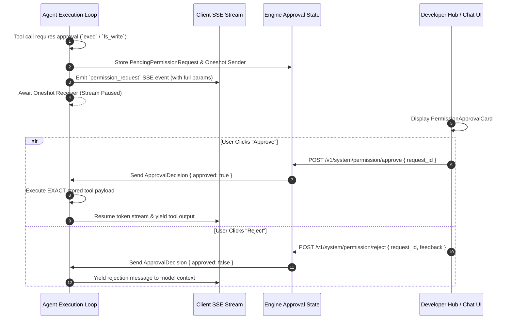

# Security & Human-in-the-Loop (HITL) Permission Gate API

> **Base Route:** `/v1/system/permission`  
> **Security Protocol:** Capability-Based Security & Real-Time Approval Channels  
> **Component:** `cluaiz_api::handlers::permission`, `engines::neural_foundry::security::permission_schema`

---

## 1. System Overview

The Cluaiz Permission system governs two critical security domains:
1. **System Governance Policy (`permission.json`):** Sets engine security modes (`strict`, `sandboxed`, `full_access`), active workspace boundaries, API authentication requirements, and WASM firewalls.
2. **Real-Time Human-in-the-Loop (HITL) Approval Gate:** Pauses streaming agent execution via in-memory `tokio::sync::oneshot` channels whenever an agent invokes a tool declaring sensitive capabilities (`exec`, `fs_write`, `network`) or accesses filesystem resources outside safe boundaries.



---

## 2. Policy Configuration Endpoints

### 2.1 Get Permission Policy (`GET /v1/system/permission`)

Retrieves the active engine permission schema along with dynamically probed model availability lists and local network IP addresses.

* **Path:** `/v1/system/permission`
* **Method:** `GET`

#### Response (`200 OK`)
```json
{
  "security_mode": "sandboxed",
  "workspace_root": "C:\\Users\\Developer\\Workspace",
  "allowed_paths": [],
  "api_auth": {
    "required": true,
    "tokens": ["sk-cluaiz-e46c11e877b20afb49c..."]
  },
  "wasm_firewall": "strict",
  "vectorize_user_input": true,
  "vectorize_ai_response": true,
  "stream_telemetry": false,
  "model_header_info": true,
  "active_slots": {
    "text": { "model_id": "llama_3.2_instruct-3b", "supported_tasks": ["chat"] }
  },
  "available_models": ["llama_3.2_instruct-3b", "whisper_base"],
  "available_chat_models": ["llama_3.2_instruct-3b"],
  "available_vector_models": ["bge-small-en-v1.5"]
}
```

---

### 2.2 Update Permission Policy (`POST /v1/system/permission`)

Updates `permission.json` dynamically and triggers runtime synchronization across active model slots.

* **Path:** `/v1/system/permission`
* **Method:** `POST`
* **Content-Type:** `application/json`

#### Request Payload
```json
{
  "security_mode": "sandboxed",
  "workspace_root": "C:\\Users\\Developer\\Workspace",
  "api_auth": {
    "required": true,
    "tokens": ["sk-cluaiz-custom-key-12345"]
  },
  "wasm_firewall": "strict",
  "vectorize_user_input": true,
  "stream_telemetry": false
}
```

| Field | Type | Options | Description |
|---|---|---|---|
| `security_mode` | `string` | `"strict"`, `"sandboxed"`, `"full_access"` | Governs filesystem containment and tool execution gates. |
| `workspace_root` | `string` | Absolute path | Directory path used as the base anchor for all relative filesystem calls. |
| `api_auth.required` | `boolean` | `true`, `false` | When `true`, all external API calls require a Bearer token. |
| `api_auth.tokens` | `array[string]` | List of API keys | Authorized API keys accepted by the engine. |
| `wasm_firewall` | `string` | `"strict"`, `"permissive"` | OS-level syscall isolation for WASM plugins. |
| `vectorize_user_input` | `boolean` | `true`, `false` | Real-time RAG embedding pipeline toggle. |

#### Response (`200 OK`)
```json
{
  "status": "success",
  "message": "permission.json successfully updated."
}
```

---

## 3. Real-Time HITL Approval Gate Endpoints

### 3.1 List Pending Permission Requests (`GET /v1/system/permission/pending`)

Returns all currently paused operations awaiting human approval.

* **Path:** `/v1/system/permission/pending`
* **Method:** `GET`

#### Response (`200 OK`)
```json
{
  "status": "success",
  "pending": [
    {
      "request_id": "7fa419ba-a5a4-441f-8e2b-ffad67a1496a",
      "tool_name": "execute_shell",
      "capabilities": ["exec"],
      "parameters": {
        "command": "cargo test --workspace"
      },
      "status": "pending",
      "timestamp": "2026-10-02T02:30:00Z"
    }
  ]
}
```

---

### 3.2 Approve Permission Request (`POST /v1/system/permission/approve`)

Approves a paused tool invocation or sensitive filesystem operation. Signals the in-memory channel to resume execution using the exact stored parameters.

* **Path:** `/v1/system/permission/approve`
* **Method:** `POST`
* **Content-Type:** `application/json`

#### Request Payload
```json
{
  "request_id": "7fa419ba-a5a4-441f-8e2b-ffad67a1496a",
  "feedback": "Approved by user"
}
```

| Parameter | Type | Required | Description |
|---|---|---|---|
| `request_id` | `string` | **Yes** | The UUID received in the `permission_request` event. |
| `feedback` | `string` | No | Optional human annotation recorded in the audit log. |

#### Response (`200 OK`)
```json
{
  "status": "success",
  "message": "Permission approved"
}
```

---

### 3.3 Reject Permission Request (`POST /v1/system/permission/reject`)

Rejects a paused operation and unblocks the agent stream, returning a denial notification to the model context so it can adapt or suggest an alternative approach.

* **Path:** `/v1/system/permission/reject`
* **Method:** `POST`
* **Content-Type:** `application/json`

#### Request Payload
```json
{
  "request_id": "7fa419ba-a5a4-441f-8e2b-ffad67a1496a",
  "feedback": "User declined terminal execution outside workspace"
}
```

#### Response (`200 OK`)
```json
{
  "status": "success",
  "message": "Permission rejected"
}
```

---

## 4. Capability Model Reference

Tools registered with the engine declare explicit capabilities. Any capability not explicitly declared is classified as sensitive by default under `sandboxed` mode:

| Capability | Scope | Default Behavior under `sandboxed` |
|---|---|---|
| `exec` | Shell processes, binary launches (`cmd.exe`, `sh`) | **Requires Human Approval** |
| `fs_write` | Mutating files, deletes, directory creation | **Requires Human Approval** |
| `network` | Inbound or outbound network socket access | **Requires Human Approval** |
| *(None / Empty)* | Read-only calculation or pure memory inspection | Executed automatically |
| *(MCP Tools)* | Any tool originating from an external Model Context Protocol server | **Requires Human Approval** |
