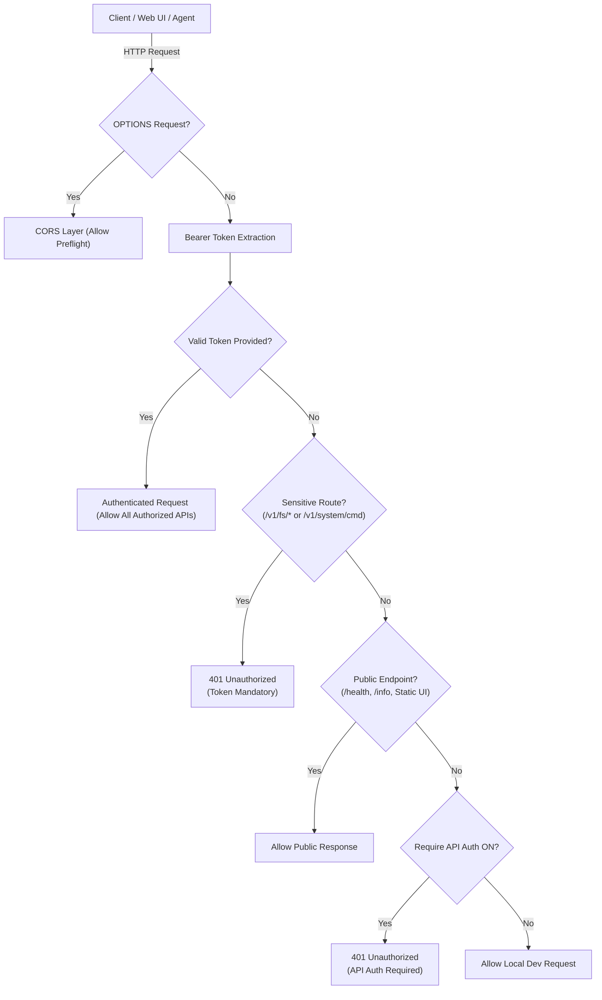

# Security & Authentication Architecture

> **Document Type:** System Architecture & Security Reference  
> **Status:** Active & Implemented  
> **Component:** `cluaiz_api`, `engines`, `engine_core`

---

## 1. Executive Summary & Threat Model

Cluaiz provides a high-performance local AI inference engine and agentic runtime. Because the engine executes tools, reads/writes files, and can run in both local desktop environments and cloud/server deployments, it enforces a defense-in-depth security model:

1. **Local Threat Model:** Protect developer laptops against browser drive-by attacks, malicious web scripts attempting cross-origin requests, and untrusted agent file escapes.
2. **Server/Cloud Threat Model:** Protect multi-tenant, remote, or LAN deployments with industry-standard Bearer Token authentication (`Authorization: Bearer sk-cluaiz-...`) without brittle hardcoded URL or origin restrictions.
3. **Reality Commitment:** The architecture is explicitly documented as **Workspace-Gated + Human-in-the-Loop (HITL) Approval**, eliminating hype terms like "OS Sandbox" in favor of concrete, verifiable controls.



---

## 2. Bearer Token Authentication Architecture

### 2.1 Dual-Token Authentication System

The engine accepts two types of cryptographic Bearer tokens via the standard `Authorization: Bearer <token>` HTTP header:

1. **User / Server API Keys (`sk-cluaiz-...`):**
   * Configured in `permission.json` under `api_auth.tokens`.
   * Generated and managed via the Developer Hub UI (Settings -> API Keys).
   * Used by external scripts, remote web apps, SDKs, and cURL clients.
2. **Local Session Token (`session.token`):**
   * Generated dynamically on engine boot (`auth::initialize_session_token`).
   * Stored in `~/.cluaiz/session.token` with restricted POSIX permissions (`0600`).
   * Injected automatically by local desktop wrappers (Tauri / Electron) for zero-configuration local security.

### 2.2 Constant-Time Comparison

To prevent timing side-channel attacks where an attacker could deduce valid token prefixes by measuring microsecond response differentials, all token checks use `constant_time_compare`:

```rust
pub fn constant_time_compare(a: &str, b: &str) -> bool {
    let a_bytes = a.as_bytes();
    let b_bytes = b.as_bytes();
    if a_bytes.len() != b_bytes.len() {
        return false;
    }
    let mut diff = 0u8;
    for (x, y) in a_bytes.iter().zip(b_bytes.iter()) {
        diff |= x ^ y;
    }
    diff == 0
}
```

### 2.3 Route Enforcement Matrix

| Route Category | Example Endpoints | When Auth Toggle is ON | When Auth Toggle is OFF (Local Dev) |
|---|---|---|---|
| **Public Probes** | `GET /health`, `GET /info` | Public (200 OK) | Public (200 OK) |
| **DevHub Static Assets** | `/`, `/index.html`, `/assets/*` | Public (200 OK) | Public (200 OK) |
| **General Inference** | `POST /v1/chat/completions`, `GET /v1/models` | **Bearer Token Required (401)** | Open for Local Prototyping (200 OK) |
| **Sensitive Filesystem** | `POST /v1/fs/read`, `/v1/fs/write`, `/v1/fs/delete` | **Bearer Token Required (401)** | **Bearer Token Required (401)** |
| **Terminal Shell Exec** | `POST /v1/system/cmd` | **Bearer Token Required (401)** | **Bearer Token Required (401)** |

> **Critical Rule:** Sensitive routes (`/v1/fs/*` and `/v1/system/cmd`) **NEVER** run without a token, regardless of the global API Authentication toggle.

---

## 3. Workspace Canonical Jail & Ancestor Traversal

Located in [`inference-engine/api/src/handlers/fs_jail.rs`](file:///c:/Users/Aryan/my/Cluaiz-workspace/Cluaiz-Technologies/cluaiz/inference-engine/api/src/handlers/fs_jail.rs).

### 3.1 Path Resolution Rules

1. **Relative Path Rooting:** Relative paths (e.g. `src/main.rs`) are always joined to `workspace_root`, never to the process working directory (CWD).
2. **Dual Canonicalization:** Both the candidate path and the workspace root are canonicalized via `std::fs::canonicalize` before comparison, ensuring Windows Extended-Length Prefixes (`\\?\`) match identically.
3. **Ancestor Walking for New Writes:** When an agent writes to a non-existent file, the resolver walks up parent directories until it finds the closest existing ancestor, canonicalizes it, and appends the uncreated child path segments.

### 3.2 Security Modes

* **Strict Mode (`strict`):** Any attempt to access a path outside the active workspace returns a hard `403 Forbidden` (`"Workspace Boundary Violation"`). No approval bypass is possible.
* **Workspace-Gated (`sandboxed`):** Safe workspace reads execute automatically. Writes, creations, and access outside the workspace register a `PendingPermissionRequest` and halt execution until explicit human approval is received.
* **Full Access (`full_access`):** Autonomous developer mode bypassing path checks.

---

## 4. Capability-Based Tool Approval & HITL Streaming

Located in [`inference-engine/engines/src/tools/registry/types.rs`](file:///c:/Users/Aryan/my/Cluaiz-workspace/Cluaiz-Technologies/cluaiz/inference-engine/engines/src/tools/registry/types.rs) and [`inference-engine/api/src/handlers/chat/agent_loop.rs`](file:///c:/Users/Aryan/my/Cluaiz-workspace/Cluaiz-Technologies/cluaiz/inference-engine/api/src/handlers/chat/agent_loop.rs).

### 4.1 Capability Declarations

Tools declare capabilities explicitly in their metadata:
* `exec`: Running system binaries, CLI commands, or scripts.
* `fs_write`: Mutating, writing, or deleting files on disk.
* `network`: Inbound or outbound network socket operations.

**Default-Deny Rule:** Any tool with undeclared capabilities (`capabilities.is_empty()`) requires explicit user approval by default under `sandboxed` and `strict` modes. All MCP (Model Context Protocol) external tools require approval under `sandboxed` and `strict` modes.

### 4.2 Transparent Payloads & Zero Post-Approval Mutation

1. Before tool execution, the engine yields an SSE chunk `permission_request` containing:
   * `request_id`: Unique UUID.
   * `tool_name`: Exact tool name.
   * `capabilities`: Declared capability list.
   * `parameters`: Fully expanded, untruncated JSON payload.
2. The agent loop pauses and awaits a signal on an in-memory `tokio::sync::oneshot` channel.
3. When the user approves via `POST /v1/system/permission/approve`, the engine resumes and executes the **exact stored parameters** received during the pause. The model cannot alter the payload between approval and execution.

---

## 5. Safe Configuration Deserialization

Located in [`inference-engine/engines/core/src/environment/config_manager.rs`](file:///c:/Users/Aryan/my/Cluaiz-workspace/Cluaiz-Technologies/cluaiz/inference-engine/engines/core/src/environment/config_manager.rs).

Configuration schemas (`permission.json`, `gguf_config.json`, `system_control.json`) prioritize human-editable JSON with `serde` defaults as the primary source of truth:
* Prevents binary layout mismatches (`rkyv` offset desync) caused by struct field additions across versions.
* Eliminates out-of-memory aborts caused by unvalidated binary zero-copy deserialization.
