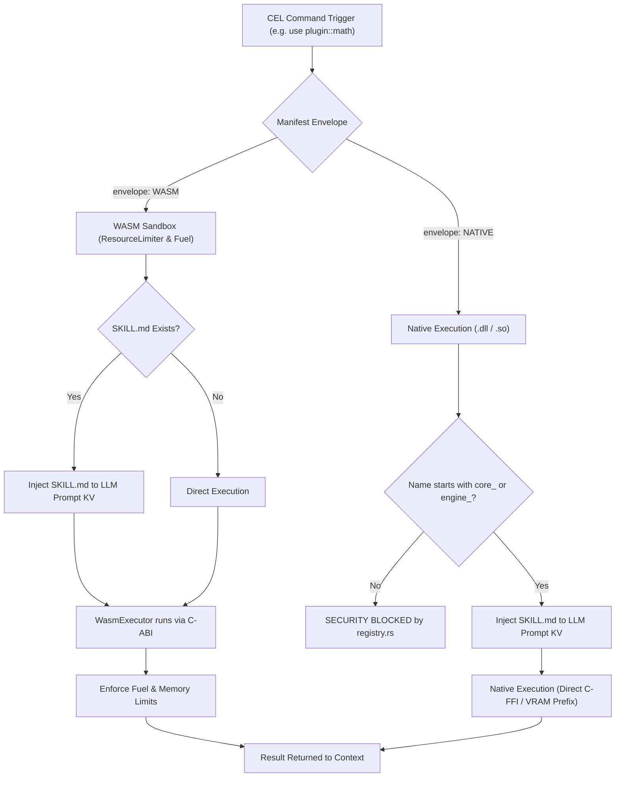

# CEL Architecture: Unified Tool & Plugin Ecosystem

## 1. TECHNICAL SPECIFICATION
- **Quadrant:** Explanation (Diátaxis Framework)
- **Purpose:** To define the architectural, security, and execution model for Plugins within the Cluaiz Engine.
- **Audience:** Core Engine Developers, Tool Authors, Security Auditors.

---

## 2. THE UNIFIED TOOL PARADIGM
Rather than fragmenting developer tools into disjoint concepts, Cluaiz treats all execution units under a single, cohesive specification: **Plugins**.

A Plugin encapsulates both the cognitive interface (optional `SKILL.md`) and the execution muscle (`WASM` bytecode or `NATIVE` C-ABI binary). The runtime envelope is declared directly in the manifest:

1. **Sandboxed Plugins (`envelope: "WASM"`):** Runs inside an isolated `wasmtime` micro-sandbox with strict fuel limits (CPU cycle caps) and `ResourceLimiter` (RAM caps). Fully safe for community-contributed tools.
2. **Native Plugins (`envelope: "NATIVE"`):** Runs via bare-metal C-FFI (`libloading`) for trusted subsystems (such as local vector stores, search, and direct VRAM prefixing).

---

## 3. ARCHITECTURE & EXECUTION FLOW



---

## 4. UNIFIED PLUGIN MANIFEST SPECIFICATION

All tools in the ecosystem share the same standardized manifest (`package.json`):

```json
{
  "name": "cluaiz-search",
  "version": "1.0.0",
  "description": "High-performance web intelligence plugin with CEL grammar.",
  "author": "Cluaiz Technologies",
  "type": "plugin",
  "discovery": {
    "semantic_triggers": ["search", "web", "lookup"],
    "cel_grammar": "use plugin::cluaiz-search -> search(...)"
  },
  "activation": {
    "lazy_load": true,
    "trigger_on": [
      "on_command:use plugin::cluaiz-search"
    ]
  },
  "permissions": {
    "max_memory_mb": 256,
    "max_cpu_time_ms": 5000
  }
}
```
  network_access: true
  vram_kv_inject: true
  file_system: "none"

execution:
  envelope: "NATIVE" # WASM | NATIVE
  entry_point: "execute_cel"
  payload_format: "MsgPack"
```
